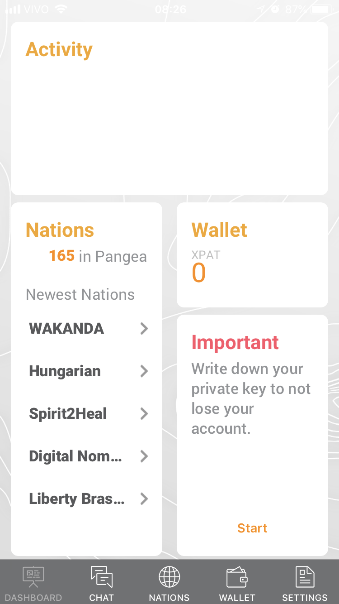

<!-- # Notas

> A função primária de qualquer nação é proteger os seus cidadãos e os
> seus bens através de uma jurisdição executiva (a autoridade prática para
> administrar a justiça numa área de responsabilidade circunscrita). A
> segurança e a justiça asseguram que os nossos bens e os nossos corpos estão
> a salvo da violência e da expropriação. Cada vez mais a segurança e a
> justiça se tendem a fundir, à medida que os nossos bens se tornam digitais.
> [@tempelhof_pangea_nodate-1]

> A Pangea oferece uma forma fácil de celebrar um contrato peer-to-peer,
> resolver quaisquer disputas que possam surgir, e incentivar o cumprimento do
> mesmo através do sistema de reputação. [@tempelhof_pangea_nodate-1]

> If you’ve never lived as a refugee or expat; if you’ve never sat down to think
> about the nature of nation-states and their degree of control over people
> within and outside their own boundaries — then you probably take for granted
> that you live under a set of rules determined by the place where you live and
> probably grew up too. [@southurst_estonian_2015]

> Global governance distances agency even further from the individual, reduces
> rather than enhances personal sovereignty and limits the choices we can make
> about how we live our lives. Most importantly, global governance takes no
> account of humanity's vital quality - its kaleidoscopic creativity and endless
> ability to reinvent itself in new and innovative ways to suit specific
> circumstances. [@tempelhof_pangea_nodate, p. 12]

* * *

- Government services
- Decentralized Borderless Voluntary Nation (DBVN)
- Public Notary
- Bitnation Refugee Emergency Response (BRER)
- “world’s first Blockchain Marriage and World Citizenship ID, Blockchain Land Title, Birth Certificate and Refugee Emergency ID during 2014 and 2015”
- contratos peer to peer
- “the arbitrariness of birth as the decider of your citizenship” [@noauthor_interview_2018]
- Holacracy
- “paying for services and abiding by applicable laws based on jurisdictions of your choice, not birth or residency.” [@southurst_estonian_2015]
- “insurance, title registration, dispute resolution and identity ” [@southurst_estonian_2015]
- “it’s a proof of concept showing what the blockchain is capable of” [@southurst_estonian_2015]
- Virtual jurisdiction

* * *

- É uma prova de conceito de bastante sucesso, dado o que já cumpriu. É um conceito interessante, e forte, mas com varias incertezas a cerem resolvidas.
- Apesar das críticas, os detalhes de implementação não importam tanto, porque a BitNation é só uma prova-de-conceito. E as ideias que queria provar foram provadas.
- Whitepaper parece um manifesto.
- Age como uma empresa qualquer?

* * *

- Quero responder:
  - Introdução: o que é, nas palavras deles.
  - De onde veio? — BitNation vem de um espirito anarquista e de uma amalgamação de ideias
    - Um desejo de superação da “oligarquia dos estados”
    - A ideia de “buffet jurisdiction” [@southurst_estonian_2015] — competição entre estados.
    - Soberania para o cidadão
    - Descolamento da ideia de _nação_ e _território_. [@noauthor_looking_nodate]
    - Descolar:
      - nação e território
      - cidadania e nascimento
    - Contra fronteiras, e contra um estado global único
  - O que é?
    - Plataforma
  - Qual o seu valor?
    - Prova de conceito
    - Não importam os problemas, se não forem centrais para o conceito.
  - Guia de leitura sobre o tema.

================================================================================ -->

# Bitnation: Um conceito de prova.

Talvez você tenha ouvido falar da [BitNation](bitnation.co). São os criadores da
plataforma _Pangea_, que de acordo com @tempelhof_pangea_nodate-1 é uma
“jurisdição descentralizada com vista à criação [...] de nações voluntárias e à
celebração e arbitragem de contratos solenes” — o que no mínimo requer uma
segunda leitura. Antes de mergulhar nos detalhes, voltemos aos princípios.

## Os “porquês”

A BitNation é construída em cima de duas _cisões conceituais_: a desconstrução
da ideia de que _nação_ está ligada a território, e de que _nacionalidade_ está
ligada ao nascimento. De acordo com Susanne Tarkowski Tempelhof, fundadora da
organização, “Bitnation está desenvolvendo um sistema de governança voluntário
peer-to-peer para substituir a _arbitrariedade do nascimento como o decisor da
sua cidadania_” (minha ênfase; @noauthor_interview_2018). Não apenas isso, as
Nações Voluntárias Descentralizadas Sem-Fronteira (DBVN, na sigla em inglês), de
que Bitnation é o exemplo primário, “não limitam os seus serviços a uma área
geográfica, etnia ou outras categorias de população específicas. [...] Pode
dizer-se que uma DBVN é ‘virtual’ pela sua própria concepção.”
[@tempelhof_pangea_nodate-1].

A alternativa, e também o principio norteador das DBVNs, é o de que cidadãos
possam “pagar por serviços e respeitar as leis aplicáveis baseados nas
jurisdições de sua escolha”, e não aquelas determinadas por “nascimento ou
residência” [@southurst_estonian_2015]. Essa ideia implica no conceito de
“jurisdição-como-serviço” (JaaS, na sigla em inglês;
@tempelhof_pangea_nodate-1), pelo qual nações competiriam pela cidadania das
pessoas, ao invés do _status-quo_ “em que os Cidadãos são forçados a competir
uns com os outros para obter os resultados governamentais desejados”
[@tempelhof_pangea_nodate-1].

Na realidade, BitNation propõe ser uma alternativa ao que é chamado de “Estado
Westfaliano”[^westfalia], o modelo sobre o qual estão construídos os modernos
estados-nação [@noauthor_paz_2018]. A opção seria pelos tais de DBVN, que, como
explicam, “são definidas como:”

[^westfalia]: Há um artigo na Wikipedia sobre o conceito de [Soberania de
  Vestfália](https://pt.wikipedia.org/wiki/Soberania_de_Vestfália), mas é
  incompleto. Recomendo também o verbete sobre os tratados da [Paz de
  Vestfália](https://pt.wikipedia.org/wiki/Paz_de_Vestfália), que seria a origem
  do modelo de estado-nação em que hoje nos baseamos. Também indico a leitura de
      [@br_refugiados_nodate](https://jus.com.br/artigos/24058/o-direito-ao-refugio-no-direito-westfaliano-de-estados),
      §2.

> - **Descentralizada:** A descentralização consiste no processo de
>   redistribuição ou dispersão de funções, poderes, pessoas ou bens de um local
>   ou autoridade central. [...] Isto significa que cada utilizador pode
>   tornar-se no seu próprio nó e transformar a plataforma de acordo com os seus
>   próprios gostos. [...] Na prática, isto significa que os vários núcleos,
>   regionais ou outros, são totalmente autônomos.
> - **Sem fronteiras:** As DBVN não limitam os seus serviços a uma área
>   geográfica, etnia ou outras categorias de população específicas. [...] Pode
>   dizer-se que uma DBVN é “virtual” pela sua própria concepção.
> - **Voluntária:** As DBVN não utilizam a força, a fraude ou a coerção, não
>   tratam os seus cidadãos como peões, nem os sujeitam à servidão involuntária,
>   servidão por dívidas ou escravatura. Como as DBVN têm uma natureza
>   voluntária estão, por inerência, livres de perseguição, intimidação,
>   represálias e outras formas de violência sistemática. As DBVN competem num
>   mercado livre em que os clientes, os “cidadãos” da plataforma, escolhem
>   voluntariamente as DBVN que pretendem utilizar — incluindo a opção de
>   utilizar várias DBVN, ou nenhuma, ou, se assim o desejarem, de criar a sua
>   própria DBVN.
> - **Nação:** [...] No caso das DBVN é provável que a ligação das pessoas [de
>   uma nação] assente tanto em interesses e objetivos mútuos como elas estariam
>   conectadas por pontos comuns mais tradicionais. Uma nação é uma criação
>   voluntária mais do que uma entidade governativa (ou seja, um Estado).

## Os “comos”

Mas o que tudo isso significa na prática? Para além dos princípios norteadores,
a Bitnation oferece uma plataforma chamada _Pangea_[^pangea], que promete
possibilitar a criação de DBVNs. Funciona “como uma jurisdição descentralizada
em que os cidadãos podem criar Nações Voluntárias, associar-se e viver nas
mesmas” [@tempelhof_pangea_nodate-1].

[^pangea]: Em nome do [supercontinente que existiu na era
paleozoica](https://pt.wikipedia.org/wiki/Pangeia), o que, como o resto do
_whitepaper_ fundacional [@tempelhof_pangea_nodate-1], tem um tom épico de um
manifesto.

Pangea é um aplicativo. Como está em [versão
beta](https://pt.wikipedia.org/wiki/Versão_beta), só é possível baixá-lo usando
o link no site.[^testflight]

[^testflight]: De lá, é possível pedir um “convite” para ser um testador (que na
verdade é só um cadastro). Você receberá um link, do qual conseguirá um código
que pode entrar no aplicativo da Apple
[TestFlight](https://developer.apple.com/testflight/), do qual conseguirá baixar
Pangea. O processo todo leva menos de dois minutos.

O aplicativo te saúda com uma tela onde é possível criar uma nova conta, ou
recuperar uma antiga. Depois de “criar uma identidade” você será recebido por um
_dashboard_.

No menu “Nations”, há uma lista de DBVNs. Cada uma conta com uma descrição, uma
“estrutura governamental”, e alguns “fatos divertidos”. É possível também criar
uma nação própria (desde que se esteja disposto a gastar um pouco de
[Ether](https://ethereum.org/ether)), da qual se pode escolher, entre outras
coisas, o tipo de “código legal” e o “tipo de governo” (que surpreendentemente
inclui “autocracia”).

No entanto, parece que por enquanto a única coisa que é possível fazer com uma
nação é usar o seu _chat_ no menu com esse nome. Na maioria dos chats há pessoas
confusas e sucessões intermináveis de “oi”s. No chat da Bitnation, que é apenas
mais uma DBVN, um “cidadão” identificado somente por “SL” colocou de forma
sucinta:

> O app Pangea ainda está em desenvolvimento. Afinal, ele será muito mais
> envolvido e você poderá usar o Pangea para criar contratos inteligentes e
> gerenciar suas nações.

## E então?

A Bitnation é uma organização cheia de ideais ousados, como vemos no seu
whitepaper. No entanto, ainda não há nada de concreto. O aplicativo, por
enquanto, é apenas um Whatsapp anônimo com menos funcionalidade, e uma porção de
“times” sem utilidade nos quais é preciso pagar para entrar.

Por outro lado, é um experiência que nos provoca a reconsiderar nossos noções
rigidamente estabelecidas sobre o que são nações, o que é nacionalidade, e o que
é cidadania. É possível que no futuro vejamos um mundo anárquico onde cada
indivíduo é livre para se associar com quem bem entender? Em que se tenha
superado o “oligopólio do Estado-nação” [@tempelhof_pangea_nodate-1]? Talvez,
mas certamente estamos muito longe disso.

Dito isso, Vinay Gupta, citado por @souli_i_2016, diz que “coisas que mudarão o
mundo sempre parecem estúpidas até você olhar para trás”. Então se você ficou
interessando no projeto, o melhor a fazer é acompanhá-lo. Talvez daqui a alguns
anos, vejamos o crescimento da primeira nação virtual do planeta, completa com
[embaixadas](https://blog.bitnation.co/embassy-review-01/) e serviços jurídicos.
Mas por enquanto, Bitnation não chega nem mesmo a ser uma prova-de-conceito; é
apenas um “conceito-de-prova”.

## Leituras

Caso você tenha se interessado no assunto, recomendo algumas leituras.

- @souli_i_2016 (inglês) traz uma visão geral do assunto.
- @tempelhof_pangea_nodate-1 (versões em inglês, português e outras línguas) é o
  whitepaper da Bitnation. Um tanto longo, com em torno de 40 páginas, mas é uma
  fonte primária.
- @southurst_estonian_2015 (inglês) também trata de outros assuntos, mas é outro
  artigo que trata do tema em geral.
- @icos_bitnation_2018 (inglês).
- Todos os textos citados tem relevância para o assunto.
- Claro, sempre vale a pena entrar no aplicativo e fuçar por si mesmo.

## Referências

<!-- ================================================================================

- Ler a seguir:
  - Holacracy Constitution

## Resumo Whitepaper

### The Internet of Sovereignty

#### Governance 1.0: A Geographical Apartheid

> Governments with territorial monopolies have been the rule through much of human history, their borders determined largely by the reach of their weapons technology.

> Technological advancements over the past 70 years have not translated into governance evolutions towards a networked society.

> Global governance distances agency even further from the individual, reduces rather than enhances personal sovereignty and limits the choices we can make about how we live our lives.

#### Governance 2.0: Borderless, Decentralised, Voluntary

> An alternative model of global governance has been identified within the natural world and ungoverned areas of human agency where, despite a lack of hierarchy and centralized decision- making, order and balance emerge in complex systems. These emergent structures are highly efficient patterns that develop from the collective actions of many individuals and entities.

> [Holacratic organizations] are set up by one or a few individuals to enable tens of thousands of people to cooperate on a common goal in their life.

- The only thing in common are “the overall goals of the Nation that each Citizen chooses to follow”.

> Yet these organizational models can only outcompete Westphalian state sovereignty if they can provide credible alternatives to the Nation State’s raison d’etre, the provision of security and justice. Voluntary Nations must provide better, more secure, faster, cheaper and peer-to-peer alternatives for these services.

#### Enter Pangea: The Internet of Sovereignty

> Bitnation’s DBVN is a peer alternative to territorial nation states in the same way that the Decentralized Autonomous Organization (DAO) is an alternative to conventional organizations

> Pangea: software infrastructure for Voluntary Nations.

- Jurisdiction as a Service (JaaS)

- **codes of law**: users can write smart contracts in chat which refer to an existing code of law
- **mediation and arbitration**: users choose human arbitrator(s) or dispute resolution DApps offering methods such as crowd juries.
- **incentivization, deterrent and enforcement**: The token-driven reputation system provides incentives for contract compliance. Multi-signature escrow functions can hold mutual assets related to contract agreements.

> The Pangea blockchain jurisdiction uses an evolutionary method of rule generation. -->
